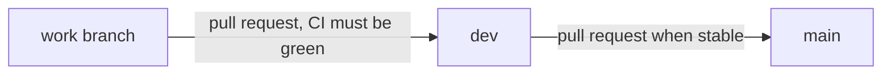

# Contributing to Tvorsvit

The development playbook for Tvorsvit. Written for a single developer, but with team-grade discipline: every change flows through the same branch, pull request, and CI pipeline — no direct pushes to protected branches, ever.

## Branch model

- `main` — stable and releasable. Only advanced from `dev` once `dev` is proven.
- `dev` — the integration branch. All work lands here first.
- Short-lived work branches — one per unit of work, deleted after merge.



## Branch naming

`<type>/<short-kebab-name>`, where `<type>` is one of `feat`, `fix`, `chore`, `docs`, `refactor`. Examples: `feat/characters`, `fix/editor-autosave`, `chore/ci`.

## Commits

Conventional Commits style, imperative mood, lowercase scope where useful:

```
feat(backend): add character CRUD endpoints
fix(frontend): restore App.css import
docs: update data model diagram
```

A commit is one logical unit. Small, focused commits beat large catch-all ones. No comments in generated source code.

## Change flow

1. From an up-to-date `dev`: `git checkout dev && git pull && git checkout -b <type>/<name>`.
2. Make changes in small conventional commits.
3. Push the branch: `git push -u origin <type>/<name>`.
4. Open a pull request against `dev`. The PR template asks for summary, changes, and testing.
5. Wait for the CI checks to pass. A PR is mergeable only when the checks are green.
6. Merge with **Create a merge commit** (no fast-forward): keeps feature commits intact and records the PR.
7. Delete the merged branch (the merge screen offers it).

## Releasing

When `dev` is stable and release-worthy, open a pull request from `dev` into `main` and merge it with a merge commit. `main` then represents a known-good point in time.

## Branch protection

`main` and `dev` are protected on GitHub: pull requests are required, CI must pass, branches must be up to date before merging, and force-pushes and deletions are blocked. This applies to everyone — including the only developer.

## Local development

Backend (terminal 1):

```
cd tvorsvit-backend
.\mvnw.cmd spring-boot:run
```

Backend tests:

```
cd tvorsvit-backend
.\mvnw.cmd test
```

Frontend (terminal 2):

```
cd tvorsvit-frontend
npm install
npm run dev
```

Frontend checks:

```
cd tvorsvit-frontend
npm run lint
npm run build
```

Open http://localhost:5173; the Vite dev server proxies `/api` to the backend on 8081.

## Storage

All data lives in one H2 file, `tvorsvit-backend/data/tvorsvit.mv.db`, which is git-ignored. Tests run against an in-memory H2 and never touch it. Backing up your writing means copying that one file with the server stopped.