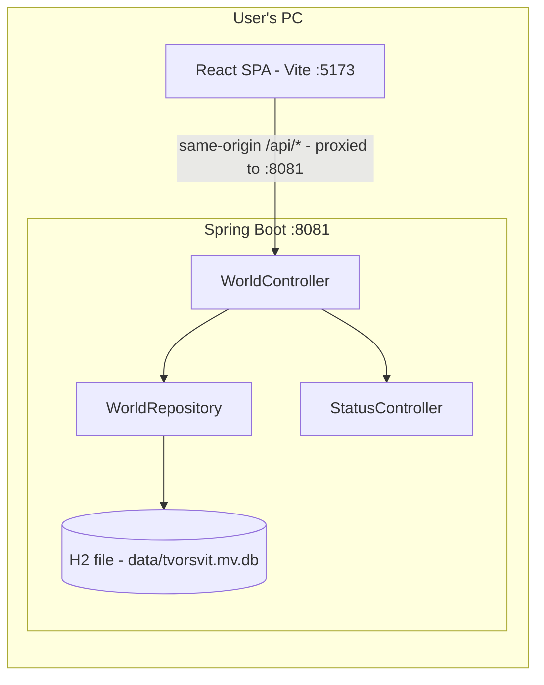

# Tvorsvit

[](https://github.com/lirriya/Tvorsvit/actions/workflows/ci.yml)

**твори світ** — "create a world"

Tvorsvit is a local-first worldbuilding and creative writing app. It lets you write novels and drafts in a distraction-free editor while building out your world: character cards, location cards, relationship links, and a graph view connecting everything by relationship, location, or shared person. All data is stored on your own PC.

## Status

Early stage. Currently a full-stack prototype: a React SPA with a **worlds dashboard** (`/`), a **writing editor** (`/worlds/:id`), and **character cards** (`/worlds/:id/characters`), backed by a Spring Boot REST API that stores worlds and characters in an embedded H2 database on your PC.

## Tech stack

| Layer | Technology |
|---|---|
| Frontend | React 19, Vite, JavaScript (JSX) |
| Backend | Java 25, Spring Boot 4.1, Maven |
| Storage | H2 embedded file database (`data/tvorsvit.mv.db`) |
| Testing | JUnit 5 / Spring Boot Test |

## Repo structure

```
tvorsvit-backend/    Spring Boot REST API (port 8081)
  src/main/java/tvorsvit/
  src/test/java/tvorsvit/
tvorsvit-frontend/   React + Vite SPA (port 5173)
  src/
```

## Architecture



## How to run

Backend (terminal 1):

```
cd tvorsvit-backend
.\mvnw.cmd spring-boot:run
```

Frontend (terminal 2):

```
cd tvorsvit-frontend
npm install
npm run dev
```

Open http://localhost:5173. The Vite dev server proxies `/api` requests to the backend on port 8081, so the SPA stays same-origin. While developing you can inspect the database directly at http://localhost:8081/h2-console (JDBC URL `jdbc:h2:file:./data/tvorsvit`). See `docs/api.md` for the endpoint reference, `docs/data-model.md` for the schema, `docs/frontend.md` for the SPA structure and data flow, and `docs/characters.md` for the character cards feature.

## Roadmap

- Editor with autosave (Google-Docs-style editing)
- Location cards — character cards are done (see `docs/characters.md`)
- Relationship links and graph view
- Authorisation and optional server-hosted data mode