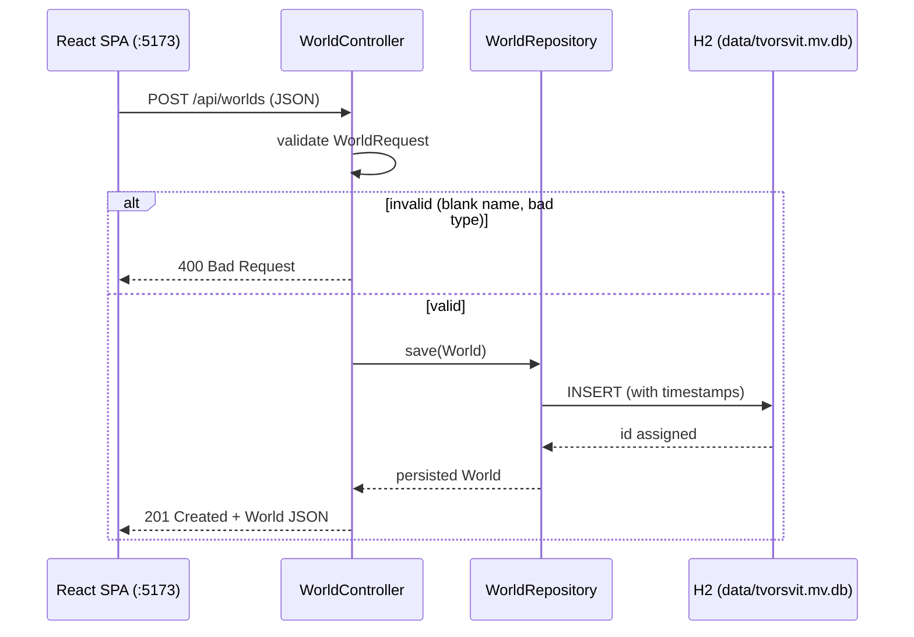

# REST API

Base URL: `http://localhost:8081` · Content type: `application/json` · CORS: `http://localhost:5173` allowed for all `/api/**` routes.

## Endpoints

| Method | Path | Purpose | Success |
|---|---|---|---|
| GET | `/api/status` | Service health / availability | 200 |
| GET | `/api/worlds` | List all worlds, newest first | 200 |
| POST | `/api/worlds` | Create a world | 201 (created body) |
| GET | `/api/worlds/{id}` | Fetch one world | 200 |
| PUT | `/api/worlds/{id}` | Update name / type / description / color | 200 (updated body) |
| PUT | `/api/worlds/{id}/content` | Update only the editor text | 200 (updated body) |
| DELETE | `/api/worlds/{id}` | Delete a world | 204 |
| GET | `/api/worlds/{id}/characters` | List characters of a world, creation order | 200 |
| POST | `/api/worlds/{id}/characters` | Create a character in a world | 201 (created body) |
| PUT | `/api/worlds/{id}/characters/{characterId}` | Update a character | 200 (updated body) |
| DELETE | `/api/worlds/{id}/characters/{characterId}` | Delete a character | 204 |

Errors: unknown id → `404`; validation or malformed payload → `400`.

## World object

```json
{
  "id": 1,
  "name": "Middle-earth",
  "type": "BOOK",
  "description": "A long ago age",
  "color": "#646cff",
  "content": null,
  "createdAt": "2026-09-24T10:05:12.345",
  "updatedAt": "2026-09-24T10:05:12.345"
}
```

| Field | Type | Notes |
|---|---|---|
| id | number | assigned by the database |
| name | string | required, non-blank, trimmed, max 80 |
| type | string | required, one of `BOOK` `TABLETOP_RPG` `GAME_LORE` `SHORT_STORY` `SCREENPLAY` `COMIC` `OTHER` |
| description | string | optional, max 300 |
| color | string | optional hex accent, e.g. `#646cff` |
| content | string | editor text; set via `PUT /api/worlds/{id}/content` |
| createdAt / updatedAt | ISO-8601 string | timestamps |

`type` values are documented in `docs/data-model.md`.

## Character object

Characters always belong to a world; their id is only meaningful inside its world.

```json
{
  "id": 1,
  "worldId": 3,
  "name": "Kaelen of the Ashwastes",
  "description": "A wandering cartographer",
  "color": "#22c55e",
  "createdAt": "2026-10-01T18:26:42.947",
  "updatedAt": "2026-10-01T18:26:42.947"
}
```

| Field | Type | Notes |
|---|---|---|
| id | number | assigned by the database |
| worldId | number | the owning world; required (path variable on create) |
| name | string | required, non-blank, trimmed, max 80 |
| description | string | optional, max 300 |
| color | string | optional hex accent, e.g. `#646cff` |
| createdAt / updatedAt | ISO-8601 string | timestamps |

The nested `world` association is intentionally not serialized — the JSON carries only `worldId`, keeping payloads flat and light.

## Example: create a character

```http
POST /api/worlds/3/characters
Content-Type: application/json

{
  "name": "Kaelen of the Ashwastes",
  "description": "A wandering cartographer",
  "color": "#22c55e"
}
```

Response `201 Created` (the stored character, with `id`, `worldId`, and timestamps filled in). `PUT` and `DELETE` use the same path with a `/characters/{characterId}` suffix. A character id that does not belong to the world in the path returns `404`.

## Example: create a world

Request:

```http
POST /api/worlds
Content-Type: application/json

{
  "name": "The Echoing Vale",
  "type": "TABLETOP_RPG",
  "description": "A haunted valley campaign setting",
  "color": "#22c55e"
}
```

Response `201 Created` (body is the full stored world, with `id` and timestamps filled in).

Minimal valid request — only `name` and `type` are required:

```json
{ "name": "Skyrim", "type": "GAME_LORE" }
```

## Example: save content

The world's content (editor text) is updated separately from its metadata:

```http
PUT /api/worlds/1/content
Content-Type: application/json

{ "content": "Chapter one. The valley slept." }
```

Response `200 OK` (the updated world, with `content` filled in). The metadata `PUT /{id}` deliberately ignores `content`, so editing world info can never wipe the user's writing.

## Validation rules

| Rule | Result |
|---|---|
| `name` blank or missing | 400 |
| `type` missing | 400 |
| `type` not one of the enum values | 400 |
| malformed JSON / unknown enum string | 400 |
| character `name` blank or missing | 400 |

Validation lives on the request DTOs (`WorldRequest`, `CharacterRequest`) at the API boundary, so invalid payloads never reach the repository.

## Create flow

