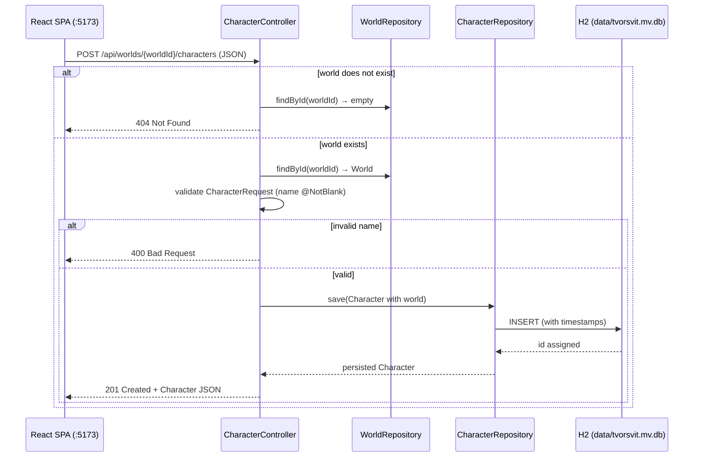
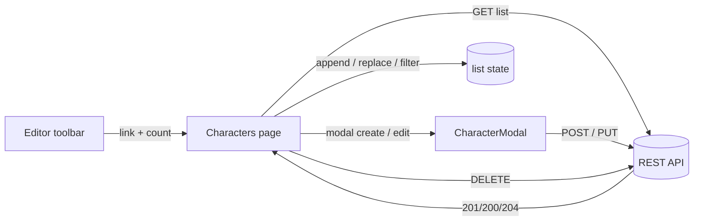

# Characters

Character cards are the first child entity of a world: named people (or beings) that belong to exactly one world. A world's cast is managed on its own page, `/worlds/:id/characters`, reached from the editor toolbar.

## Backend

New package under `tvorsvit.character`, mirroring the `world` package structure:

```
tvorsvit/
  character/Character           -- the entity
  character/CharacterRepository -- Spring Data JPA repository
  character/CharacterRequest    -- request DTO (validation at the API boundary)
  character/CharacterController -- REST mapping, nested under /api/worlds/{worldId}/characters
```

### Endpoints

| Method | Path | Purpose | Success |
|---|---|---|---|
| GET | `/api/worlds/{worldId}/characters` | List characters of a world, in creation order | 200 |
| POST | `/api/worlds/{worldId}/characters` | Create a character in a world | 201 (created body) |
| PUT | `/api/worlds/{worldId}/characters/{id}` | Update name / description / color | 200 (updated body) |
| DELETE | `/api/worlds/{worldId}/characters/{id}` | Delete a character | 204 |

Errors: unknown world → `404`; unknown id → `404`; character id that does not belong to the world in the path → `404`; blank name → `400`.

### Design decisions

- **World-scoped nesting.** The universe is hierarchical: a world has characters. Nesting the routes under `/api/worlds/{worldId}` mirrors that in the URL, and every mutation re-verifies the character belongs to the world in the path — a character from world A can never be edited through world B's URL.
- **No `@OneToMany` on `World`.** Worlds stay lean in JSON (no surprise child payloads, no lazy-loading traps). Characters are always loaded through explicit repository queries.
- **`@OnDelete(CASCADE)` on the FK.** Deleting a world removes its characters at the database level, so a world delete can never fail on orphaned rows.
- **`worldId` in JSON instead of a nested `world`.** The entity keeps the `@ManyToOne` association, but the field is `@JsonIgnore`d and a derived `getWorldId()` getter exposes just the foreign key — the API payload is flat and light.
- **Repository query** uses `findByWorld_Id` (explicit path with underscore) so Spring Data unambiguously traverses `world → id` rather than guessing a `worldId` property.

### Create flow



## Frontend

- Route `/worlds/:id/characters`, linked from the editor toolbar with a live count (**Characters (n)**).
- `pages/Characters.jsx` owns the list state. Mutations update the list in place — created characters are appended (matching the creation-order sort of the API), edited ones replace their slot, deleted ones are filtered out — no full refetch.
- `components/CharacterCard.jsx` shows name, description, and accent color, with Edit / Delete actions.
- `components/CharacterModal.jsx` is **one component, two modes**: `character === null` renders "New character" and calls `createCharacter`; a populated `character` renders "Edit character" and calls `updateCharacter`. The payload shape is identical, so only the API function and the title/button label differ.

### UI data flow

