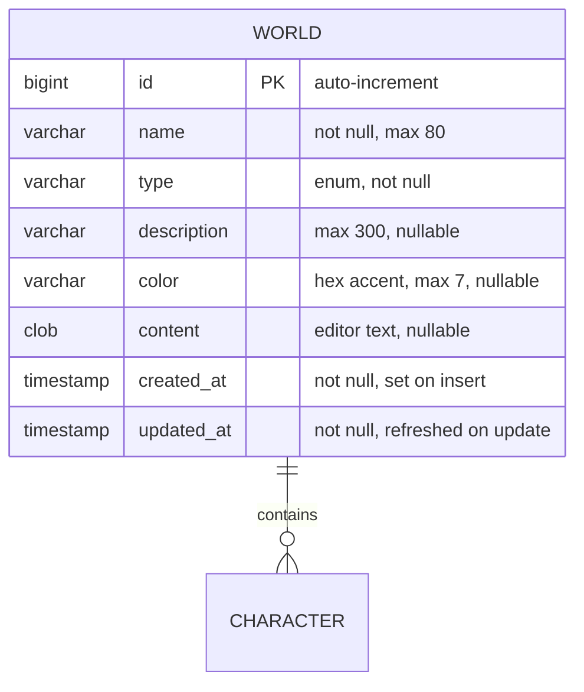
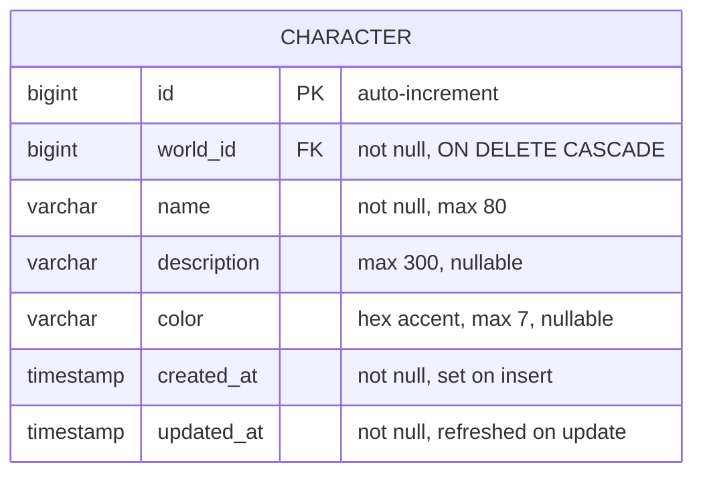

# Data model

How Tvorsvit stores data. Stack: Spring Boot 4.1, Spring Data JPA (Hibernate), H2 embedded file database.

## Storage overview

| Aspect | Detail |
|---|---|
| Database file | `data/tvorsvit.mv.db`, created on first run in the backend working directory |
| Schema management | Hibernate `ddl-auto=update` — tables are created/altered automatically on startup |
| Writes | Any process using the API (WAL-style file, `AUTO_SERVER=TRUE` allows multiple processes) |
| Git | `data/` is ignored — local worlds are never committed accidentally |
| Tests | A separate profile (`application-test.properties`) uses an in-memory H2 DB with `create-drop`, so automated tests never touch dev data |

## Entities

### World

A `World` is the top-level container: one story universe the user is building (a novel, a tabletop campaign, game lore, a screenplay, ...). All child entities (characters, locations, relationships) belong to a world.



Field notes:

- **type** — stored as a string enum (`EnumType.STRING`), not an ordinal. Reordering enum values in code therefore never corrupts existing rows, and the stored values stay readable (`BOOK`, `TABLETOP_RPG`, `GAME_LORE`, `SHORT_STORY`, `SCREENPLAY`, `COMIC`, `OTHER`).
- **created_at / updated_at** — inherited from `BaseEntity`, a `@MappedSuperclass`. JPA lifecycle callbacks (`@PrePersist` / `@PreUpdate`) stamp them, so every future entity gets audit timestamps for free, written once in one place.
- **content** — the drafting text, set via `PUT /api/worlds/{id}/content` (see `docs/api.md`).
- **color** — a hex accent used by the frontend cards and the editor theme.

### Character

A `Character` belongs to exactly one `World` (`@ManyToOne`, non-nullable foreign key `world_id`). Characters are world-scoped: they are created, listed, updated and deleted through nested routes under `/api/worlds/{worldId}/characters`.



Field notes:

- **world_id** — the owning world. The FK is declared `ON DELETE CASCADE` (`@OnDelete(CASCADE)`), so deleting a world removes its characters at the database level and can never fail on orphaned rows.
- **JSON shape** — the association itself is `@JsonIgnore`d; instead a derived getter exposes `worldId` (the foreign key). The API payload stays flat, and the heavy `World` object (including its `content`) is never embedded in a character response.
- **Read path** — worlds do **not** hold a back-reference collection (`@OneToMany` is deliberately absent). Characters are loaded via `CharacterRepository.findByWorld_IdOrderByCreatedAtAsc`, so `World` objects stay lean and JSON cannot accidentally dump children.

## Entity layout in code

```
tvorsvit/
  common/BaseEntity        -- createdAt / updatedAt (mapped superclass)
  world/World              -- the entity
  world/WorldType          -- enum
  world/WorldRepository    -- Spring Data JPA repository
  world/WorldRequest       -- request DTO (validation at the API boundary)
  world/WorldController    -- REST mapping
  character/Character      -- the entity (world-scoped)
  character/CharacterRepository
  character/CharacterRequest
  character/CharacterController
  config/WebConfig         -- global CORS
```

The request DTO (`WorldRequest`) is intentionally separate from the entity: validation (`@NotBlank`, `@NotNull`) lives on the DTO, while the entity only enforces database-level constraints (`nullable = false`, lengths). The API rejects bad input before it ever reaches the database.