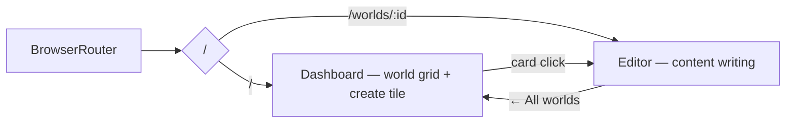
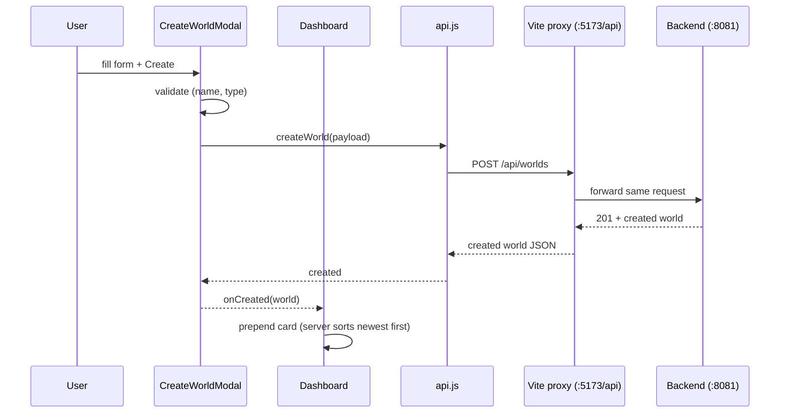
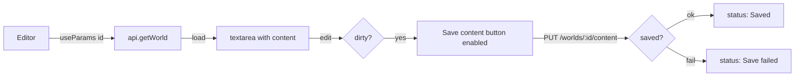

# Frontend

The Tvorsvit SPA: routes, the worlds dashboard and the world editor. Stack: React 19, Vite, react-router-dom. Talks to the backend through the Vite dev proxy (`/api` → `http://localhost:8081`), so requests stay same-origin.

## App structure

```
src/
  main.jsx                 entry point; mounts BrowserRouter
  App.jsx                  route table
  api.js                   REST client (one fetch wrapper + semantic functions)
  worldTypes.js            enum → label mapping shared by card and modal
  index.css / App.css      global base + component styles
  components/
    WorldCard.jsx          card that links to /worlds/:id
    CreateWorldModal.jsx   create form as a modal dialog
  pages/
    Dashboard.jsx          "/" — world grid + "+ Create new world" tile
    Editor.jsx             "/worlds/:id" — write and save content
```

## Routes



The URL is the source of truth: the editor knows *which* world to show from `:id` (via `useParams`), and both views are deep-linkable (back/forward, bookmarks, refresh all work).

## Create flow



## Editor flow



## Decisions worth knowing

- **Proxy instead of absolute URLs**: same-origin requests in dev (no CORS preflight, works from LAN devices). The backend CORS config remains as a safety net.
- **Optimistic prepend**: the create response is used directly instead of refetching — one less round trip, and it matches the server's newest-first order.
- **Native form semantics**: Enter submits from the name field (implicit submission), Enter in the textarea makes a newline; Escape and backdrop click close the modal via one tiny handler.
- **`react-hooks/set-state-in-effect`**: data loading wires `setState` through promise callbacks (`.then`), never synchronously in an effect body, per the current React hooks lint rules.
- **`<Link>` for cards**: cards are navigations, so they are anchors — middle-click, keyboard focus and screen-reader semantics come free.